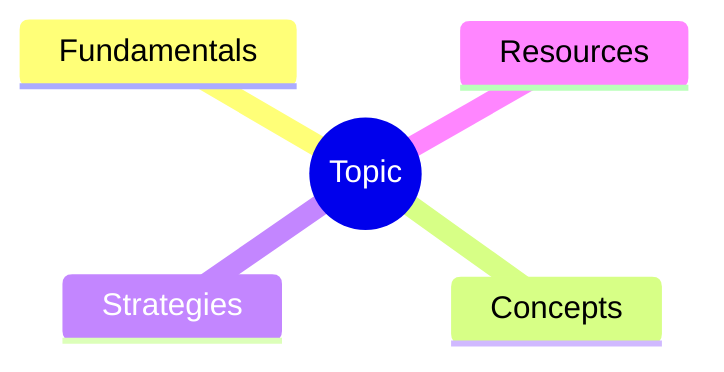
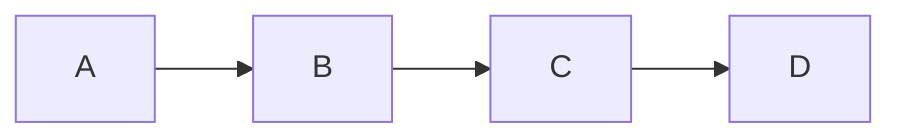
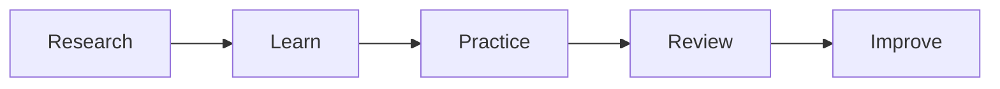
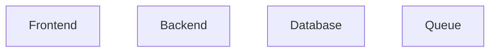

# Skill: Create Obsidian Wiki From Research (v2)

## Purpose

Transform deep research reports, papers, PDFs, repositories, documentation, notes, and external resources into a professionally structured Obsidian knowledge system.

The output is not a document.

The output is a maintainable, interconnected, source-backed wiki.

Inspired by:

- internal engineering portals
- architecture knowledge bases
- developer wikis
- digital gardens
- second-brain systems
- technical documentation platforms

Optimized for:

- Obsidian
- Git versioning
- Dataview
- Graph View
- Long-term maintenance
- Incremental updates

---

# Integration With Deep Research Skill

This skill expects that a Deep Research report already exists.

Preferred inputs:

1. Deep Research report
2. Research notes
3. PDFs
4. Documentation
5. Repositories
6. Community discussions
7. Existing vault notes

The research report becomes the canonical evidence source.

Additional sources may be fetched when:

- concept gaps exist
- best practices are missing
- FAQs are incomplete
- examples are insufficient
- implementation guidance is weak

All enrichment must remain source-backed.

---

# Non-Negotiable Rules

1. Never invent information.
2. Every factual statement must be traceable.
3. No source → no fact.
4. Explicitly mark uncertainty.
5. Prefer primary sources.
6. Follow references when important context is missing.
7. Community knowledge is supplemental, never authoritative by itself.
8. Every page must belong to the graph.
9. Every page requires frontmatter.
10. Every page requires related links.
11. Every page requires sources.
12. Every wiki must contain a review strategy.
13. Do not use caveman style, compressed wording, telegraphic fragments, or shorthand in wiki pages, reports, or user-facing summaries.
14. Be concise and informative, but never compress away explanations, source context, caveats, or link rationale.

---

# Writing Quality

Write wiki content in normal professional prose. Keep pages focused and scannable, but preserve enough context for a future reader to understand what the concept means, why it matters, how it connects to adjacent notes, and which sources support it.

Avoid:

- caveman-style fragments
- artificial shorthand
- note-only summaries without context
- unexplained acronyms or labels
- source lists without synthesis
- omitting caveats to make pages shorter

Prefer:

- short complete paragraphs
- precise headings
- concise bullets with complete meaning
- explicit source context
- clear uncertainty markers
- wikilinks with enough surrounding explanation to make the relationship useful

---

# Placement Decision

Automatically determine destination.

## Project Scope

Use:

```text
02 Projects/<Project>/wiki/
```

Examples:

- implementation guides
- repositories
- ADRs
- system architecture
- project documentation
- APIs
- product knowledge

## Global Knowledge

Use:

```text
03 Wiki/<Topic>/
```

Examples:

- Trading
- React
- TypeScript
- Psychology
- Leadership
- Investing
- Productivity

## Required Output

Always provide:

```markdown
Placement Decision:
Reason:
Target Folder:
```

---

# Wiki Structure

Minimum structure:

```text
wiki/
├── Home.md
├── Glossary.md
├── FAQ.md
├── Resources.md
├── Learning Path.md
├── Best Practices.md
├── Common Mistakes.md
├── Coverage Report.md
├── Concepts/
├── Guides/
├── Playbooks/
├── References/
├── Diagrams/
├── ADRs/
└── Assets/
```

Create folders only when relevant.

---

# Maps of Content (MOCs)

Generate dedicated MOCs.

Example:

```text
MOCs/
├── Concepts MOC.md
├── Playbooks MOC.md
├── Architecture MOC.md
└── Resources MOC.md
```

Template:

```markdown
# Concepts MOC

## Fundamentals

- [[Concept A]]
- [[Concept B]]

## Intermediate

- [[Concept C]]

## Advanced

- [[Concept D]]
```

MOCs should become primary navigation hubs.

---

# Home Page Generation

Required sections:

```markdown
# Topic Knowledge System

## Overview

## Core Navigation

## Learning Path

## Key Concepts

## Playbooks

## Best Practices

## Frequently Asked Questions

## Resources

## Related Knowledge Systems
```

---

Frontmatter:

```yaml
---
id: topic-home
title: Topic Knowledge System
type: overview
status: active
version: 1.0.0
review_cycle_days: 30
created:
updated:
---
```

---

# Learning Path Generator

Automatically classify:

### Beginner

Prerequisites and fundamentals

### Intermediate

Applied concepts

### Advanced

Optimization and edge cases

Example:

```markdown
## Beginner

1. [[Glossary]]
2. [[Fundamentals]]
3. [[Core Concepts]]

## Intermediate

1. [[Workflow]]
2. [[Patterns]]
3. [[Case Studies]]

## Advanced

1. [[Optimization]]
2. [[Tradeoffs]]
3. [[Failure Analysis]]
```

---

# Glossary Generation

Generate from research automatically.

Template:

```markdown
# Term

Definition

## Why It Matters

## Related

- [[Concept]]
```

Every glossary term links back into the graph.

---

# FAQ Generation

Sources:

- research report
- documentation
- issues
- community discussions
- common misconceptions

Template:

```markdown
## Question

Answer

### Sources
```

Include beginner and advanced questions.

---

# Best Practices Generation

Collect:

- official recommendations
- maintainer guidance
- expert advice
- proven community patterns

Template:

```markdown
## Recommendation

### Why

### Benefits

### Tradeoffs

### Sources
```

---

# Common Mistakes Page

Automatically generate.

Sources:

- issue trackers
- troubleshooting docs
- community discussions
- implementation failures

Template:

```markdown
## Mistake

### Why It Happens

### Consequences

### How To Avoid

### Sources
```

This page is mandatory.

---

# Concept Pages

Template:

```yaml
---
id:
title:
type: concept
difficulty:
status: active
review_cycle_days:
created:
updated:
---
```

Required sections:

```markdown
# Concept

## Definition

## Why It Matters

## How It Works

## Examples

## Best Practices

## Common Mistakes

## Related Concepts

## Review Questions

## Sources
```

---

# Guide Pages

Use for educational content.

Template:

```markdown
# Guide

## Goal

## Prerequisites

## Concepts Used

## Walkthrough

## Examples

## Further Reading

## Sources
```

---

# Playbook Pages

Template:

```markdown
# Playbook

## Purpose

## Preconditions

## Checklist

## Step-by-Step Workflow

## Failure Modes

## Best Practices

## Sources
```

---

# ADR Generation

If decisions are present:

Generate:

```text
ADRs/
```

Template:

```markdown
# ADR-001

## Context

## Decision

## Consequences

## Alternatives Considered

## Sources
```

---

# Mermaid Diagram Generation

Always generate at least:

1. Knowledge Map
2. Dependency Graph

If applicable also generate:

3. Workflow Diagram
4. Architecture Diagram
5. Lifecycle Diagram

---

## Knowledge Map



---

## Dependency Graph



---

## Workflow Diagram



---

## Architecture Diagram



---

# Obsidian Linking Rules

Always use:

```markdown
[[Page]]
```

Never create plain internal references.

Every page requires:

```markdown
## Related

- [[...]]
- [[...]]
```

No orphan pages allowed.

---

# Dataview Support

Generate Dataview snippets when Dataview is available.

## Recently Updated

```dataview
TABLE updated
FROM ""
SORT updated DESC
LIMIT 20
```

## Review Due

```dataview
TABLE review_cycle_days
FROM ""
```

## Pages Without Sources

```dataview
LIST
FROM ""
WHERE !contains(file.content,"## Sources")
```

## Orphan Detection

Recommend generation of orphan reports.

---

# Coverage Report

Generate:

```markdown
# Coverage Report
```

Sections:

## Covered Concepts

List everything documented.

## Missing Concepts

Research gaps.

## Weakly Sourced Areas

Needs additional verification.

## Suggested Future Pages

Potential expansion candidates.

## Open Questions

Unresolved findings.

Mandatory.

---

# Resource Catalog

Required categories:

```markdown
# Resources

## Official Documentation

## Standards

## Books

## Papers

## Articles

## Repositories

## Videos

## Communities
```

For each resource:

- title
- URL
- type
- rationale

---

# Versioning Strategy

If wiki already exists:

Increment:

```yaml
version:
```

Rules:

Patch:

- typo
- formatting
- minor additions

Minor:

- new pages
- expanded content

Major:

- structural redesign
- significant reorganization

---

# Link Validation Pass

Before completion:

Validate:

- all wiki links exist
- no dead references
- MOCs reference valid pages
- Home references valid pages
- Learning path references valid pages

Generate:

```markdown
# Link Validation Report
```

if issues exist.

---

# Graph Optimization

Ensure graph quality.

Targets:

- every page >= 2 inbound links
- every page >= 2 outbound links
- central hub pages exist
- concept clusters are discoverable

Graph View should reveal meaningful topic clusters.

---

# Review System

Every page requires:

```markdown
## Review Questions
```

Example:

```markdown
1. What is this concept?
2. Why is it important?
3. What are common mistakes?
4. How does it connect to related concepts?
```

---

# Source Tracking

Every page ends with:

```markdown
## Sources
```

Preferred:

```markdown
1. Official Documentation
2. Whitepaper
3. Research Report
4. Repository
```

Community sources:

```markdown
## Community References
```

must remain separate.

---

# Second Brain Integration

Preferred locations:

```text
00 Context/
01 Inbox/
02 Projects/
03 Wiki/
```

Wiki creation rules:

Project:

```text
02 Projects/<Project>/wiki/
```

Global:

```text
03 Wiki/<Topic>/
```

Optional additions:

```text
03 Wiki/<Topic>/MOCs/
03 Wiki/<Topic>/Diagrams/
03 Wiki/<Topic>/Resources/
```

---

# Completion Checklist

Verify:

- [ ] Placement decision exists
- [ ] Home page exists
- [ ] MOCs generated
- [ ] Learning path exists
- [ ] Glossary exists
- [ ] FAQ exists
- [ ] Best practices exist
- [ ] Common mistakes exist
- [ ] Coverage report exists
- [ ] Resource catalog exists
- [ ] Concept pages exist
- [ ] Guides exist where useful
- [ ] Playbooks exist where useful
- [ ] Diagrams exist
- [ ] Frontmatter exists everywhere
- [ ] Review questions exist
- [ ] Sources exist
- [ ] Graph contains no orphan pages
- [ ] Link validation completed
- [ ] Dataview snippets generated
- [ ] Wiki is extensible

---

# Success Criteria

The wiki should feel like a professionally maintained internal knowledge base.

A newcomer should be able to:

1. Start at Home.md
2. Follow a learning path
3. Understand concepts
4. Discover relationships
5. Find implementation guidance
6. Review knowledge later
7. Trace every fact back to a source

If this is not possible, continue improving the wiki before finishing.
